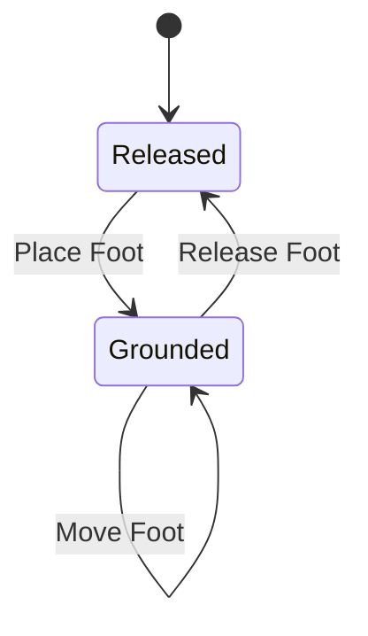

# Foot Inverse Kinematics

The process of [Inverse Kinematics](https://docs.unity3d.com/Manual/InverseKinematics.html)
is used to move an avatar's target and smoothly turn bones and other
parameters to reach that target. When a character is moving around in a
stage, it is nice to have the player's feet stay on the ground when they
are moving as a person would naturally move their feet instead
of having them float off or slide on the ground.

I am using the [HumanoidFootIK](xref:nickmaltbie.OpenKCC.Animation.HumanoidFootIK)
behavior to manage humanoid avatar foot placement. This class uses
two [FootTarget](xref:nickmaltbie.OpenKCC.Animation.FootTarget) to manage
the target for the left and right feet for the character.
Each of these foot targets is a state machine with two different states: grounded
or released.

The humanoid avatar manages when to ground or release each foot by looking
at the animation curve for the
[LeftFootIKWeight](xref:nickmaltbie.OpenKCC.Animation.FootTarget.LeftFootIKWeight)
or the [RightFootIKWeight](xref:nickmaltbie.OpenKCC.Animation.FootTarget.RightFootIKWeight).

These animation curves can be created either manually or by using the
[HumanoidFootIKEditor](xref:nickmaltbie.OpenKCC.Editor.HumanoidFootIKEditor).
But be aware, this may overwrite existing animation curves so make sure you
configure it properly and backup your data.

Once each animation has the curves associated with them, the [HumanoidFootIK](xref:nickmaltbie.OpenKCC.Animation.HumanoidFootIK)
should be able to read this data and dynamically place the character's feet
on the ground while they walk.

## Humanoid Foot IK Properties

The [HumanoidFootIK](xref:nickmaltbie.OpenKCC.Animation.HumanoidFootIK) behavior
manages placing the player's feet on the ground with a few different properties.

* [groundCheckDist](xref:nickmaltbie.OpenKCC.Animation.HumanoidFootIK.groundCheckDist)
    \- Distance at which this will check to the ground from the player's knee height.
* [stepHeight](xref:nickmaltbie.OpenKCC.Animation.HumanoidFootIK.stepHeight)
    \- How high player will lift feet when stepping in place.
* [strideThresholdDistance](xref:nickmaltbie.OpenKCC.Animation.HumanoidFootIK.strideThresholdDistance)
    \- Distance threshold above which the player will release
    their foot from the ground. This is the distance between the current
    target/desired position and the current position the foot is on the
* [strideThresholdDegrees](xref:nickmaltbie.OpenKCC.Animation.HumanoidFootIK.strideThresholdDegrees)
    \- Degrees of rotation above which the player will rotate their foot
    when their foot is a given number of degrees away from their
    current facing.
* [strideTime](xref:nickmaltbie.OpenKCC.Animation.HumanoidFootIK.strideTime)
    \- Time for the player to complete a grounded stride.
* [placeBlendTime](xref:nickmaltbie.OpenKCC.Animation.HumanoidFootIK.placeBlendTime)
    \- Blend time between foot in the air and being placed on the ground
    in seconds.
* [footGroundedHeight](xref:nickmaltbie.OpenKCC.Animation.HumanoidFootIK.footGroundedHeight)
    \- How far off the ground are the feet bones when the player's foot
    is grounded.
* [maxHipFootDistance](xref:nickmaltbie.OpenKCC.Animation.HumanoidFootIK.maxHipFootDistance)
    \- Max distance the player's foot should be from the hips, above
    which the player will over their hips down to properly place
    feet on the ground.
* [hipSmoothTime](xref:nickmaltbie.OpenKCC.Animation.HumanoidFootIK.hipSmoothTime)
    \- Time to take to sooth hip offset from the ground.

Every time the foot should be grounded, the behavior will check
to try and place the foot on the ground in the current location if it's
not already grounded. If the foot should be released, the the behavior
will attempt to release the foot form the ground. This is managed
through a state machine design in the [FootTarget](xref:nickmaltbie.OpenKCC.Animation.FootTarget)
class.

## Foot Target State Machine

The foot target is a state machine that has two main state: grounded and released.
Additionally, the foot has some extra properties for managing when it
should or should not be updated via [FootTarget.MidStride](xref:nickmaltbie.OpenKCC.Animation.FootTarget.MidStride)

Some logical properties for managing the foot placement include the
following (not directly written in the code but these concepts
were used to create the design):

* Current Target Position and Rotation - Where the player wants to place
    their feet and current rotation of foot.
* Previous Target Position and Rotation - Where the player is moving
    their feet from.
* Animation Target Position and Rotation - Where the animation dictates
    that the foot should be placed.
* Foot IK Weight - Weight for blending between animation position
    and target position for foot.
* Most Recent Stride Time - The previous time in which the
    player took a stride to ground their foot.
* Mid Stride - Is the foot currently moving from one target position to
    another target position.

There are three basic transitions each with different triggers

* Ground the foot when released
    * This happens when there is valid ground below the player
    and they need to ground the foot.
* Release the foot when grounded
    * This happens when the player animation wants to release
    the foot or when the current foot position has moved too
    far away from the desired position.
* Move the foot while grounded
    * This last transition is from grounded state to grounded
    and will be triggered when the player's hips have turned
    far enough to trigger the foot moving. In the code, this
    is called a "bump" step because the code will "bump" the
    foot up a short distance to simulate the avatar lifting and
    setting down their foot.

## Placing or Releasing Feet

So, now that we have the basic concept of the state machine, let's
discuss how the feet are placed or released from the ground.

The [HumanoidFootIK](xref:nickmaltbie.OpenKCC.Animation.HumanoidFootIK)
class manages the animator and will
update the target foot IK position, rotation, and IK weight
each frame based on the relevant foot targets.
These foot targets are also updated based on their state each
animator frame update.

When the foot is released, the foot ik weight will be close to
zero so it will follow the normal animation. When the foot
is placed, the foot ik weight will be close to one so it will follow
the current target position. This foot ik weight value is smoothly
blended either towards zero when the foot should be released
or towards one when the foot should be grounded.

Whenever the character wants to place their foot down, the
target position is updated to the current target position of the player
with a short blend time so it locks in place quickly but does
not snap down instantly.

When the character wants to release their foot, the
target position is not updated and the foot IK weight value is
smoothly decreased to allow the foot to return to its normal
animation position.

* This can be triggered by either the animation weight dropping
    below a specific value or if the foot has moved too far away.

The final transition is when the player moves the foot
while grounded. In the code this is controlled with the `UseBump`
property of the foot target. This will set the from position
to the current target and the to position as the new target and
smoothly translate and rotate the foot from the previous position
to the new position while lifting it slightly in the air.

The code for placing or moving the foot on the ground is managed
via the `FootTarget.StartStride` function. Then the
[HumanoidFootIK](xref:nickmaltbie.OpenKCC.Animation.HumanoidFootIK)
manages both state machines for the left and right foot to update
them each frame so the feet move smoothly.

## Hip Movements

The last large problem to handle for the humanoid foot placement
is when the ground is below the character. The character is represented
by a collider shape which doesn't perfectly align with the avatar.
However, to get around this, we can shift the avatar's hips
up or down depending on how close the feet are to the ground.

If one foot can be grounded but their leg isn't long enough to
reach, we can smoothly lower the avatar's hips down so that the player
can place their foot on the lower ground.
This is managed via the
[HumanoidFootIK](xref:nickmaltbie.OpenKCC.Animation.HumanoidFootIK)
every farme.
