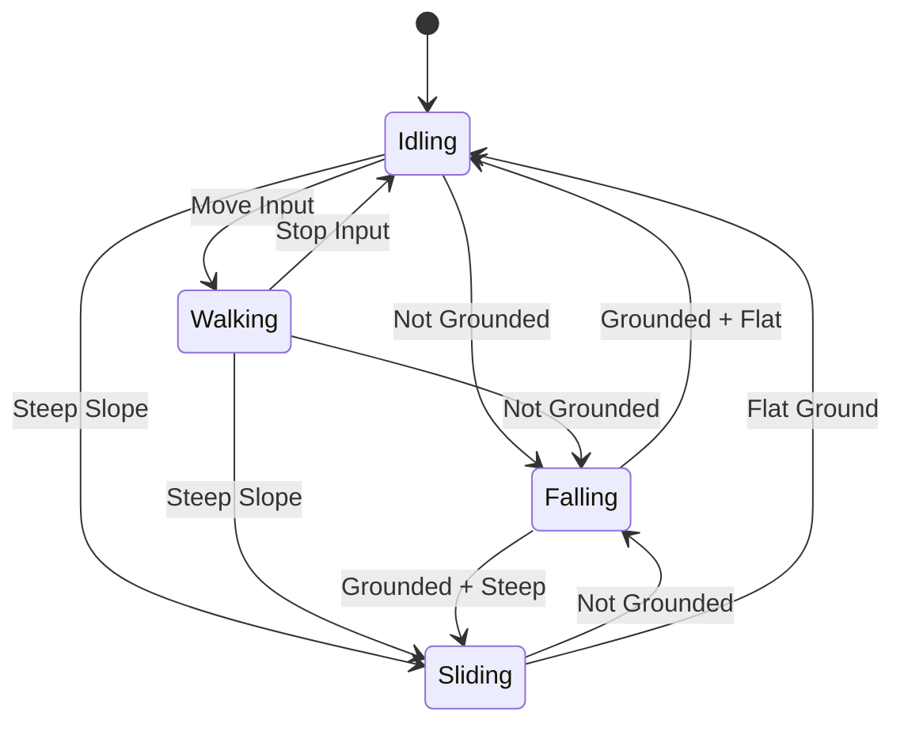

# State Machine Design

In order to manage the movement and controls of the
kinematic character controller, the OpenKCC will use a
[Finite State Machine](https://en.wikipedia.org/wiki/Finite-state_machine)
(FSM) based design to manage character actions.

The character controller will have high level "states"
that can be changed based on external input or internal
changes. The character will act differently
based on these states.

## State Overview

The state machine for the OpenKCC is composed
of a few different states.

* Idling - When the player is standing still on the ground
* Walking - When the player is moving around
* Falling - When the player is not standing on something
* Sliding - When the player is standing on a steep surface

Each of these states will have a different set of
capabilities and behaviors and will transition to
other states based on external input.

### Transition Diagram

### State Attributes

Each state of the KCC will have a few different
attributes:

* State name and transitions
* Animation to play during state (if any)
* Behavior on entry, exit, and update
* Available player inputs
    such as movement, camera control, etc...

In addition, each transition will also
have a set of configurations that include:

* Conditions to trigger transition
* Animation to play on transition (if any)
* Transition time and configuration
    such as allow early exit/cancellation

## Code Design

The code for this is still in development
but it will be managed via a few different classes.
The main design of these classes will be managed
by a set of [C# Attributes](https://learn.microsoft.com/en-us/dotnet/csharp/programming-guide/concepts/attributes/)
to configure and manage controls for the state machine
directly from the C# code.

* StateMachine - class to manage a set of states and transitions.
* State - A state for a given FSM.
* TransitionAttribute - Attribute to define and manage
    the transitions for a given state.
* AnimationAttribute - Attribute to configure an animation
    or set of animations to play based on a configuration.
* Entry and exit behaviors defined via the attributes:

    * OnEnterState - Called when state is entered
    * OnExitState - Called when the state is exited

* Update Attributes to be triggered on various [MonoBehaviour](https://docs.unity3d.com/ScriptReference/MonoBehaviour.html)
    functions including the following subset. There are other
    messages defined for the unity MonoBehaviour but these
    are the only planned ones as of now, feel free to extend
    the code or add your own events if you wish.

    * OnUpdate - Called each frame.
    * OnFixedUpdate - Called each fixed update.
    * OnLateUpdate - Called at the end of each frame.
    * OnGUI - Called each GUI update.
    * OnEnable - Called when object is enabled.
    * OnDisable - Called when object is disabled.
    * OnAnimatorIk - Callback for setting up animation IK (inverse kinematics).

## Customization

You may want to design your own character controller or
other object based on this state machine design, feel
free to use or extend the code however you see fit.
As of right now, there is only one state machine example
in the project of the character controller
but you can extend or change it however you wish.
