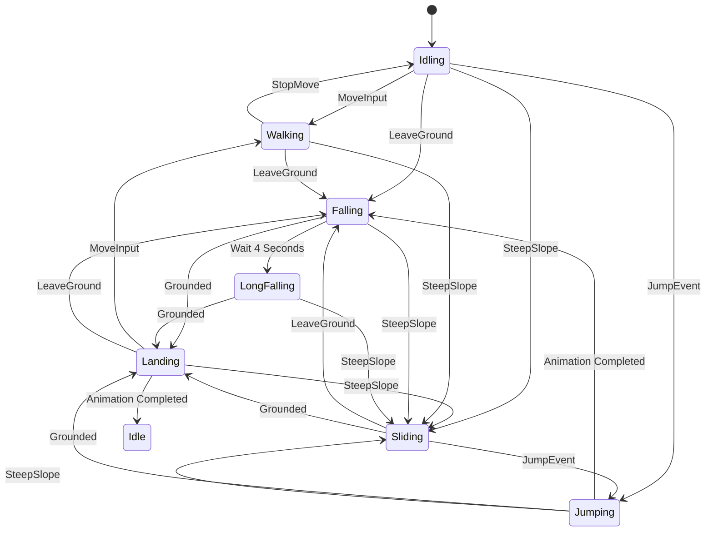

# State Machine Design

In order to manage the movement and controls of the
kinematic character controller, the OpenKCC will use a
[Finite State Machine](https://en.wikipedia.org/wiki/Finite-state_machine)
(FSM) based design to manage character actions.

The character controller will have high level "states"
that can be changed based on external input or internal
changes. The character will act differently
based on these states.

## State Overview

The state machine for the OpenKCC is composed
of a few different states.

* Idling - When the player is standing still on the ground
* Walking - When the player is moving around
* Jumping - When the player starts the jumping action
* Falling - When the player is not standing on something
* Sliding - When the player is standing on a steep surface
* Landing - Brief transition period between falling and grounded states

Each of these states will have a different set of
capabilities and behaviors and will transition to
other states based on external input.

### Transition Diagram

